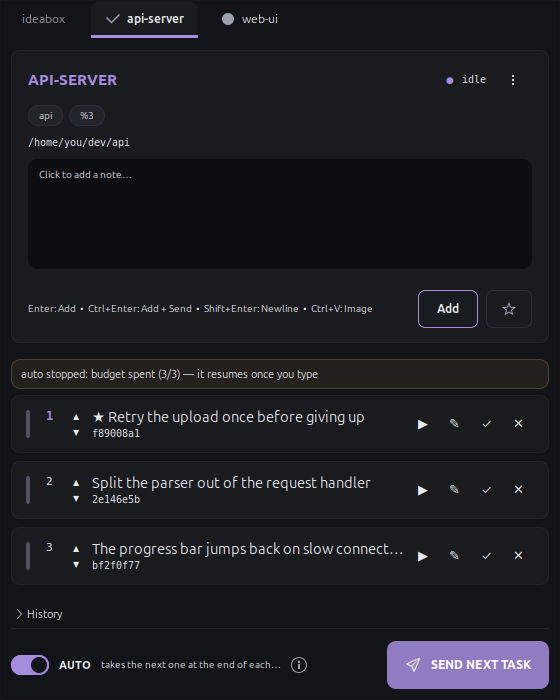
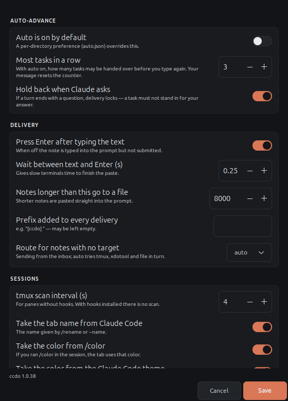

# ccdo

A note and task queue that lives in the system tray. The point: while the
Claude Code CLI is busy with one thing, park the next idea **without
interrupting the session**, then hand it over when the current work finishes.

The window opens **a tab per live Claude Code session**. A note goes to the
session whose tab you wrote it under — no guessing.

<picture>
  <source media="(prefers-color-scheme: dark)" srcset="docs/note-window-dark.png">
  <source media="(prefers-color-scheme: light)" srcset="docs/note-window-light.png">
  
</picture>

## What runs where

| | Queue, hooks, `/next` | Delivery into the prompt | Window and tray |
|---|---|---|---|
| **Linux** | yes | yes, over tmux | yes |
| **macOS** | yes | yes, over tmux | yes, via Homebrew GTK |
| **Windows** | in WSL | in WSL | in WSL |

On macOS the installer pulls `pygobject3`, `gtk+3` and `tmux` through Homebrew,
and registers a launchd agent so ccdo starts at login — the same job the
systemd user unit does on Linux. The tray icon lands in the menu bar.

Two things there are not what a Linux install gives you. There is no
AppIndicator on macOS, so the tray falls back to `Gtk.StatusIcon`, which means
the icon carries no pending-task badge — the count is in the menu and the
tooltip instead. And GdkPixbuf on macOS usually ships without an SVG loader,
so the icon is drawn with Cairo and saved as PNG rather than used as a vector.

Native Windows is not supported and is not planned. Without tmux the thing
that makes ccdo worth using — typing the task into a waiting prompt — cannot
exist, so what would be left is the queue alone. Under WSL it is Linux and
everything above applies.

## Install

```bash
curl -fsSL https://raw.githubusercontent.com/corevider/ccdo/main/install.sh | bash
```

Then restart any running Claude Code sessions so they pick up the hooks. To
remove it later: `ccdo-uninstall` (add `--purge` to delete your queue and
settings too).

The installer sets up the Claude Code hooks for you. They are what make the
session match exact instead of guessed, and everyone who installs ccdo wants
them. It merges into `~/.claude/settings.json` rather than overwriting, takes
a backup first, and re-running replaces its own entries instead of piling up.
`CCDO_SKIP_HOOKS=1` opts out, and `ccdo install-hooks` does it later.

The install line takes the latest release. `main` is where work in progress
lands, so handing that to someone installing for the first time would give
them something that was never released. To pin a version — to go back after a
bad release, say:

```bash
curl -fsSL https://raw.githubusercontent.com/corevider/ccdo/main/install.sh | CCDO_REF=v1.0.6 bash
```

The installer works out what is missing before it reaches for a package
manager — an update run needs none of it — and knows `apt`, `dnf`, `pacman`,
`zypper` and Homebrew. It drops `ccdo` and `claude-tmux` into `~/.local/bin`
and registers a service that starts at login: a systemd user unit on Linux, a
launchd agent on macOS. Nothing else is required: Python 3 and GTK 3 are the
whole dependency list, and only the window needs GTK.

It also pins the installed copy's shebang to a `python3` that can import `gi`.
`env python3` is not enough — Homebrew puts PyGObject in its own Python while
`/usr/bin/python3` wins the PATH, and a virtualenv can do the same on Linux.

`CCDO_SKIP_DEPS=1` skips the package step entirely.

On GNOME the tray icon needs an extension:

```bash
sudo apt install -y gnome-shell-extension-appindicator
gnome-extensions enable ubuntu-appindicators@ubuntu.com
```

On KDE, XFCE or Cinnamon, start it as `ccdo --statusicon` and a left click
opens the window directly (with AppIndicator a left click opens the menu —
that is a libappindicator limitation).

## Is tmux required — no

With the hooks installed, **tmux is optional.** There are two delivery routes:

| Situation | Target | Delivery |
|---|---|---|
| Claude Code inside tmux | `%12` (pane ID) | `tmux send-keys` — typed into the prompt at once |
| Claude Code in a plain terminal | `sid:<session_id>` | the `Stop` hook — Claude takes the task when the turn ends |

In the second case the send button does not mean "send now" but **"queue it"**:
the task is marked, and the hook hands it over the moment Claude finishes its
current turn. The button label says so.

### An idle session

The `Stop` hook only fires when **a turn ends**. If Claude is waiting for you
to type, there is no turn to end and the task cannot be delivered on its own —
the tab's notice line says as much, and the reason lands in the decision log.

Three ways out:

1. Type **`/next`** in that session — it pulls the task immediately (`ccdo
   next` looks at the working directory to pick that session's queue). Works
   with auto off.
2. Switch **auto** on and type anything — when the turn ends the hook hands
   over the next task.
3. Start Claude Code with `claude-tmux` (below) — the wait disappears entirely
   and the send button types into the prompt at once.

If `ccdo next`'s working directory matches no session it only hands over
untargeted inbox tasks; it will not pull from another session's queue. Use
`ccdo next --any` if that is what you want.

### Why you have to wait outside tmux

We cannot hand a task to an idle session by ourselves because **no route into
the terminal is open**. This is not a missing feature, it is the desktop
closing the door:

| Route | Why it does not work |
|---|---|
| `xdotool` | X11 only; on a Wayland session it cannot see the window |
| `wtype` | needs the wlroots virtual keyboard protocol, which GNOME/mutter does not implement |
| `ydotool` | types into whatever has focus — the target cannot be chosen, and it risks typing into the wrong place |
| TIOCSTI | disabled in the kernel via `dev.tty.legacy_tiocsti=0`; needs root for a foreign tty |

The answer is not injection but putting the session somewhere ccdo can write:
tmux.

### claude-tmux

`claude-tmux` starts Claude Code inside its own tmux session. The
`SessionStart` hook then sees `$TMUX_PANE`, the target becomes a permanent pane
ID, and the send button writes **in every case** — even while the session sits
idle.

```
claude-tmux                 # opens a tmux session named cc-<dir>
alias claude=claude-tmux    # for muscle memory
```

Details: it does not nest if you are already inside tmux; a second session in
the same directory gets `cc-<dir>-2` (two Claudes cannot share a pane);
non-interactive calls such as `claude -p`, `--version` or `mcp` do not open
tmux at all; without tmux installed it warns and carries on with plain
`claude`.

Tasks you hand over by hand do not spend the `max_auto_advance` budget — that
budget is only for what the **auto** switch pulls on its own.

## How it finds sessions

With the hooks installed, sessions come from Claude Code itself and no scanning
happens. For panes without hooks, every `discover_interval` seconds (4 by
default) all tmux panes are scanned and each pane's **process tree** is checked
for `claude`. That way node processes running alongside — a dev server, a
bundler — are not mistaken for sessions. Without `ps`, the pane command and
title are matched as text (`pane_match`).

A closed session does not lose its tab: it stays marked "closed" with its notes
intact, and the tab comes back to life when the session reopens.

## Label and color

### The Claude Code session name

A tab's name comes from the session's name in Claude Code. That name is not
kept in a file of its own; it is written into the transcript `.jsonl` as an
entry:

| Entry | Where it comes from | Priority |
|---|---|---|
| `custom-title` | `/rename` or `--name` | highest |
| `agent-name` | the name shown in the prompt bar | middle |
| `ai-title` | the generated title | lowest |

ccdo reads the tail of the transcript and takes the highest-priority, most
recently written title. After a `/rename` the tab name updates on the next
scan.

Order: `config.sessions[...].label` → the transcript name → `session_title`
from the `SessionStart` hook → the working directory's name.

To turn it off: `"use_claude_session_name": false`.

### The state mark

Left of the name on each tab sits that session's current state, so a glance at
the window shows which one is waiting for you:

| Mark | State | What it means |
|---|---|---|
| `●` | running | Claude is working a turn |
| `✓` | idle | the turn ended, your move |
| `❓` | asked a question | the turn ended with a question — delivery is locked |
| `⚠` | waiting on a prompt | a permission prompt is open |
| `·` | ended | the session closed, its notes remain |

The same mark appears in the page header alongside the words (`❓ asked a
question`); both come from one table (`STATE_MARKS`) and cannot drift apart.
Tabs with no state, such as the inbox, carry no mark.

### The session color from `/color`

Running `/color red` in Claude Code drops a
`{"type":"agent-color","agentColor":"red"}` entry into the transcript; ccdo
reads it and paints the tab, the note box border and the send button in that
color. The color of the session in your terminal then matches the color of its
tab.

The name list lives inside Claude Code and is not visible from outside, so the
known names are mapped (`red`, `green`, `yellow`, `blue`, `magenta`, `cyan`,
`orange`, `purple`, `pink`, `teal`, `gray`, `white`, `black`) and direct values
such as `#rrggbb` or `rgb(...)` are accepted too. An unrecognised name falls
back to the older route (theme → palette).

`/color` **outranks the project theme**: a theme belongs to the project, while
`/color` was chosen deliberately for that one session. A color pinned by hand
in `config.sessions[...].color` beats both.

To turn it off: `"use_claude_agent_color": false`.

### The color from a Claude Code theme

If a session uses a custom Claude Code theme (`/theme` → a custom one), ccdo
takes that theme's **`claude`** accent and paints the tab, the note box border,
the send button and the first task with it.

The theme preference is read from the layered settings — walking up from the
working directory through `.claude/settings.local.json` →
`.claude/settings.json`, then `~/.claude/settings.json`. So picking a theme per
project gives every session its own color:

```json
// ~/dev/api/.claude/settings.json
{ "theme": "custom:ocean" }
```

```json
// ~/.claude/themes/ocean.json
{ "name": "Ocean", "base": "dark", "overrides": { "claude": "#50a0c8" } }
```

The color is taken from the first of `claude` → `promptBorder` → `planMode`
that exists. `#rrggbb`, `#rgb`, `rgb(r,g,b)`, `ansi256(n)` and `ansi:<name>`
are all supported.

Built-in themes (`dark`, `light`, …) yield no color: every session would land
on the same one and the point of telling sessions apart would be lost. The
palette takes over there. Editing the theme file updates the color on the next
scan.

To turn it off: `"use_claude_theme_color": false`.

The `SOURCE` column in `ccdo sessions` says where a color came from: `/color`,
a theme name, `config` or `palette`.

### Pinning by hand

A label comes, in order, from `config.sessions[...].label` → the pane title →
the working directory's name → the tmux session name. The color is picked from
an 8-color palette by the CRC32 of the label; if two sessions land on the same
one, one is shifted to a free color. To pin either:

```json
{
  "sessions": {
    "api": { "label": "API server", "color": "#7fc98f",
             "queue_file": "/home/you/dev/api/QUEUE.md" }
  }
}
```

The key may be a full target (`api:0.0`) or just the session name (`api`);
using the session name is sturdier, since it survives a change in window order.

## Delivery

A note with a target is typed straight into its own pane with `tmux send-keys`.
If Claude Code is busy it queues the message and handles it when the turn ends
— focus does not move, work is not interrupted.

Multi-line notes go over directly too: the text is pasted with `tmux
set-buffer` + `paste-buffer -p -r` as a **bracketed paste**, so it reaches the
pane between `ESC[200~` and `ESC[201~` with raw newlines. Claude cannot tell it
from a real paste, and the newlines do not submit the message halfway through.
`-r` is required: without it tmux turns newlines into carriage returns and the
first line submits on its own.

Falling back to a file is reserved for notes past `inline_max_chars` (8000 by
default): the text is written to `~/.local/share/ccdo/drops/<id>-<slug>.md` and
a single "read this file and do it" line goes to the terminal. If the paste
fails for any reason (an old tmux, say) delivery takes that route by itself.

**ideabox** is the tab for notes with no target (anything added from the CLI
without `--target` lands there). Sending from it reaches tmux only if there is
exactly one live session; otherwise it falls back to `xdotool` or the queue
file. The `⇄` button moves a note to a session.

### Pasting an image

You can paste a screenshot into the note box with **Ctrl+V**. When the
clipboard carries an image rather than text, ccdo writes it to
`~/.local/share/ccdo/images/` as PNG and puts **its path** into the note; when
the task is handed over, Claude Code reads that path and sees the image. Image
files copied from a file manager (`file://` URIs) are added the same way.

Keeping images as paths is what lets the queue, the history and the drop files
stay plain text — no binary is embedded anywhere.

## Claude Code hooks (recommended)

`ccdo install-hooks` adds five hooks to `~/.claude/settings.json` (leaving your
own alone, writing beside them, taking a backup first). With these in place the
guessing layer is switched off entirely:

| Hook | What it buys |
|---|---|
| `SessionStart` | Claude Code reports its own `session_id` and `$TMUX_PANE` — the match is exact, no scanning |
| `SessionEnd` | a closed session marks its tab at once |
| `UserPromptSubmit` | the session is marked busy and the auto-advance counter resets |
| `Notification` | delivery is blocked while a permission prompt is open |
| `Stop` | when the turn ends, the next task is handed over |

If the `SOURCE` column in `ccdo sessions` says `hook` the match is exact;
`scan` means it is still a guess from the tmux scan.

### Order

The queue order is the only source of truth: **the first task is the next
task.** Every row shows its position and moves with `▲`/`▼`. The order is kept
in `queue.json` and comes back unchanged after a restart.

★ is a visual mark only and does **not** change the order. (It used to sort the
queue silently, which broke the order you had arranged by hand.)

### When Claude asks a question

Claude sometimes ends a turn with a question: *"shall I move on to phase 3, or
write the tests first?"*. Injecting a queued task at that moment **stands in
for your answer** and the question is swallowed silently.

ccdo prevents that. In the `Stop` hook the last assistant message is read, and
if it ends in a decision or approval question the session is marked `asking`:

- auto-advance skips that turn (with a notification),
- the send button and `ccdo send` lock too — **including the tmux route**,
  because typing into the terminal also answers the question,
- the tab shows `❓ asked a question` and says what happened.

Your answer (`UserPromptSubmit`) lifts the lock.

Detection is English out of the box: messages ending in a question mark,
*should I / would you like / want me to / let me know / next phase*, and
numbered option lists containing a question mark. Other languages contribute
their own patterns through their locale file (see **Translations**). The inside
of code blocks is not scanned, and a question mark mid-sentence does not
trigger it.

A false positive is cheap (one turn is skipped and the next `Stop` carries on);
a false negative is expensive — so it errs on the cautious side.

```json
{
  "skip_advance_on_question": true,
  "question_patterns": ["\\bare you sure\\b"]
}
```

To send anyway: `ccdo send <id> --force`.

### Auto-advance

The `Stop` hook can return `{"decision": "block", "reason": "<task>"}`, which
keeps Claude from stopping and continues the conversation. So ticking **auto**
on a tab empties the queue by itself: Claude finishes one task, takes the next,
finishes that, takes another.

No key is ever injected into the terminal — the `tmux send-keys` route is out
of the picture entirely, which also removes the `auto_enter` risk.

**With auto off, ccdo hands over nothing on its own.** That is a hard rule: the
`Stop` hook only delivers while auto is on. With it off, a task moves only when
you make it — the send button in a tmux session, `/next` anywhere.

There are two brakes:

- Off by default, switched on by hand.
- `max_auto_advance` (3 by default): at most this many tasks in a row before
  you type again. Your message (`UserPromptSubmit`) resets the counter.

Still, mind that with auto on Claude works through tasks while you are not
watching. Keep it off on projects where you want to review each step.

The guard against an endless loop is that counter. Claude Code's
`stop_hook_active` flag is **not** consulted: it is also set on the `Stop` that
follows a task the hook itself handed over, so watching it cut the chain at the
first task and turned the `max_auto_advance` budget into dead code.

### Why it didn't go — the decision log

Every delivery decision is written to `~/.local/share/ccdo/events.jsonl` with
its reason: what went, what did not, and why.

```
ccdo log            # the last 30 decisions
ccdo log 100 %0     # one session, the last 100
```

```
2026-08-11 01:42:07  %0   auto: task handed over (3/3)
                            rebuild the search index
2026-08-11 01:42:31  %0   auto stopped: budget spent (3/3) — it resumes once you type
                            add a progress bar to the loader
```

While tasks are pending, **the last obstacle also shows in the window** — in
the notice line under the note box. So "why didn't it come?" is answered
without opening the log. A successful delivery voids the reason, so an obstacle
that has cleared does not stay on screen.

The same reason is written once, not repeatedly: a cause like `auto is off` is
reborn at the end of every turn, and writing them all would make the log
unreadable. The file is trimmed at 2000 lines.

The log, the desktop notification and the window's notice all feed from one
table (`EVENT_TEXT`) and cannot drift apart.

### Where the auto preference lives

`auto` belongs to the **working directory**, not to the session
(`~/.local/share/ccdo/auto.json`). Closing and reopening Claude mints a new
`session_id`; had the preference been tied to the session, the switch would
have turned itself off every time — leaving the queue unemptied while you
believed auto was on. A session opened in a subdirectory belongs to the same
project and inherits it; the longest matching path wins, so a preference set on
a subdirectory is not overridden by the one above.

### Installing the hooks

The installer does this for you; `ccdo install-hooks` is for doing it later or
after `CCDO_SKIP_HOOKS=1`.

```bash
ccdo install-hooks              # write them
ccdo install-hooks --dry-run    # see what would be written first
```

Then restart any running Claude Code sessions. To check: type `/hooks` inside a
session and five ccdo entries should be listed.

If a hook errors it exits 0 quietly — a fault in ccdo must never break a Claude
Code session.

## Version and updates

```bash
ccdo version            # the installed version
ccdo version --check    # ask GitHub whether a newer one is out
ccdo update             # print the update command
ccdo update --apply     # run it, then restart the tray
```

`--apply` is opt-in on purpose: piping a remote script into a shell is not
something to do behind your back, so without the flag the command is only
printed. It asks before running unless you pass `--yes`.

The command pins the release it just told you about (`CCDO_REF=v1.2.3`), so
what arrives is what the notice named.

Once a day the tray checks in the background whether a newer release exists and
adds an **Update available** line to the menu if so. Asking on every start
would be wasteful and would tie startup to a network delay; failure is silent.
The check contacts `api.github.com` and nothing else, and
`"check_updates": false` turns it off.

Updating replaces ccdo in place; your settings, queue and history stay put.

### Cutting a release

```bash
tools/release.sh patch     # or minor, major, or an explicit 1.2.3
git push origin main && git push origin v1.2.3
```

The script bumps `VERSION`, runs the tests, rebuilds `ccdo-setup.sh`, prepends
a section to `CHANGELOG.md` and tags the commit. Pushing the tag triggers
`.github/workflows/release.yml`, which runs the tests again, checks the tag
agrees with `VERSION` and publishes the release with notes built from the
commit log.

That check matters: a tag that disagrees with `VERSION` breaks the update check
silently, leaving ccdo offering an update the user already has.

Release notes and the `CHANGELOG.md` entry are both produced by
`tools/changelog.py` from conventional commits (`feat:`, `fix:`, `perf:`), so
they cannot say different things. Commits that carry no user-visible change
(`chore`, `docs`, `test`, …) are left out; one that does not follow the
convention still shows up under **Other** rather than vanishing.

## Translations

Source strings are English. A catalog is a flat JSON file mapping the source
string to its translation, so adding a language means dropping one file in —
no build step, no gettext toolchain, no extra dependency.

```
locales/tr.json   Türkçe
```

To add one, copy `locales/tr.json` to `<code>.json`, translate the values, and
drop it into `~/.local/share/ccdo/locales/`. It appears in the settings window
straight away. Pull requests welcome.

The language is chosen by `"language"`: `auto` (the default) follows the
desktop's `LC_ALL` / `LC_MESSAGES` / `LANG`, or name a code directly. A missing
or broken catalog is never an error — untranslated strings fall back to their
English source.

A catalog can also teach ccdo how questions look in its language:

```json
{
  "__meta__": {
    "name": "Türkçe",
    "question_patterns": ["(yapayım mı|devam edeyim mi)"]
  },
  "Save": "Kaydet"
}
```

Those patterns are merged with the built-in English ones while that language is
active, so the "Claude asked a question" lock works there too.

## Shortcut

Settings → Keyboard → Custom Shortcuts:

| Command | Suggested key |
|---|---|
| `~/.local/bin/ccdo show` | Super+N |
| `~/.local/bin/ccdo send` | Super+Shift+N |

## The tray menu

The first item is **➕ Quick note…** — it opens a small box; type and press
Enter and the note joins the queue (`Ctrl+Enter` adds and sends, `Ctrl+V`
pastes an image). Each session's submenu also has **➕ Note for this session…**
with the target already set.

A text entry cannot be embedded in the menu itself: AppIndicator exports the
menu over DBus (`com.canonical.dbusmenu`), and that protocol carries labels and
marks only, never embedded widgets. So a menu item opens the box instead; the
type-and-Enter flow stays as quick.

**Settings…** opens the settings window (below). **Queue file** and **Decision
log** open the file in a text editor. `xdg-open` is not used: it goes by the
extension, and `.json` is bound to the browser on most desktops, so
`config.json` opened in Firefox instead of an editor. The order is the default
application for `text/plain` → the editors we know of (`gnome-text-editor`,
`gedit`, `kate`, …) → `xdg-open` as a last resort.

## The design language

Every surface — the note window, settings, quick note, edit — feeds from one
token set. Repeating colors rule by rule meant a tone fixed in one window
stayed stale in another.

There are two palettes, `THEME_DARK` and `THEME_LIGHT`, and they carry **the
same keys**, so the CSS stays a single template. Whichever the desktop asks for
is loaded; if the preference changes mid-session (one click on GNOME) the CSS
is reloaded, no restart needed.

The preference is not read from a single source, because none of them is enough
alone: `org.gnome.desktop.interface color-scheme` → GTK's
`gtk-application-prefer-dark-theme` flag → the theme name. On Yaru,
color-scheme can say `prefer-dark` while the flag stays `False`.

| Token | For |
|---|---|
| `bg` `surface` `sunken` `raised` `raised_hi` | ground → card → input → button → hover |
| `border` `border_soft` | frames and separators |
| `text` `dim` `faint` | headings → secondary text → muted |
| `accent` `accent_hi` `accent_ink` | the accent for surfaces with no session color |
| `r_lg` `r_md` | corner radius for cards/inputs and buttons |

On surfaces that do have a session color the accent token is replaced by that
session's color; those rules are generated in `rebuild_accent_css`. The send
button's text color is derived from its background (`ink_for`), because the
palette holds both dark and light tones and fixed dark text disappeared on a
dark session color.

`switch`, `checkbutton`, `spinbutton`, `combobox`, the selected tab's underline
and the scrollbar are all styled explicitly — otherwise the system theme's
colors leak in: on Ubuntu a checked box came up green, the tab underline green
and the switch orange, none of them from the app's palette.

Emoji presentation is switched off for glyphs (`text_glyph`, U+FE0E). Measured:
`❓` and `⭐` fell through to **Noto Color Emoji** in fontconfig while the other
marks were already single-color. The star was moved to `★` (DejaVu) so it can
take the accent color.

The window's title bar is a `Gtk.HeaderBar` (CSD): the desktop draws the
close/minimise/maximise buttons and lays them out per the user's
`button-layout`. That is why element-level CSS rules sit under **`.jd-body`**
rather than `.jd-window` — our provider priority beats the theme, so
`.jd-window button` would have flattened the title buttons too.

In the settings window, related fields are grouped in a **card** (`.jd-card`)
under a `.jd-section` heading. In the note window the session header, the
identity chips and the note box share one card (`.jd-sesscard`); tasks get
their own (`.jd-taskcard`).

`auto` used to be a small checkbox right beside the send button: a narrow
target, and "send now" sat next to "change the mode", so hitting the wrong one
was easy. It is now a switch of its own at the opposite end of the bottom bar,
with a line beside it saying what the current mode does.

## Window shortcuts

| Key | What it does |
|---|---|
| `Enter` | add the note to this session's queue |
| `Shift+Enter` | newline |
| `Ctrl+Enter` | add **and** send right away |
| `Ctrl+V` | add the screenshot on the clipboard (its path is written) |
| `Ctrl+1..9` / `Ctrl+Tab` | switch tabs |
| `Esc` | close |

You can also **scroll over the tabs** to move between them; it wraps at both
ends. Scrolling works on the tab strip only — in the note box or the task list
the wheel does its usual job and does not change tabs.

Tabs can be **dragged** into a different order. The order holds for that run
(and survives a session opening or closing) but resets when the app restarts: a
tab's identity is a `sid:<session_id>` or a tmux pane ID, and both change on
every start, so a saved order would refer to nothing.

Text you have typed is kept per tab — a half-written note survives the session
list changing and the tabs being rebuilt.

Row buttons: `▲`/`▼` reorder · `✎` edit · `▶` send · `✓` done · `✕` delete.
**Double-clicking** a task's text opens the editor too.

In the edit window you can change the text, move the task to another session
and toggle ★. `Ctrl+Enter` saves, `Esc` cancels.

## The Claude Code side

```bash
mkdir -p ~/.claude/commands && cp claude-commands/*.md ~/.claude/commands/
```

- `/queue` → lists pending tasks
- `/next` → pulls the next one and does it

This is the alternative flow that never touches tmux: you type `/next` when you
finish something.

## CLI

```bash
ccdo add "text" [--target api] [--project name]   # --target accepts a session name
ccdo install-hooks [--dry-run]      # install the Claude Code hooks
ccdo sessions                       # live sessions: color, label, target, state
ccdo auto <target> on|off           # switch auto (written per directory)
ccdo hook <event>                   # hook entry point (Claude Code calls this, not you)
ccdo targets                        # raw tmux pane list (* = counted as Claude)
ccdo list [target]
ccdo peek | next
ccdo send [id]
ccdo done <id> | delete <id>
ccdo history [n]                    # what left the queue (completed + deleted)
ccdo show | toggle
ccdo log [n] [target]               # delivery decisions: what went, what didn't, why
ccdo version [--check] | update [--apply]
ccdo diag                           # walk through theme and name resolution
ccdo path
```

## Files

```
~/.config/ccdo/config.json          settings
~/.local/share/ccdo/queue.json      the single source of truth
~/.local/share/ccdo/QUEUE.md        generated, readable queue
~/.local/share/ccdo/history.jsonl   what left the queue (append-only)
~/.local/share/ccdo/HISTORY.md      generated, readable history
~/.local/share/ccdo/drops/*.md      long notes in file form
~/.local/share/ccdo/images/*.png    pasted screenshots
~/.local/share/ccdo/auto.json       the 'auto' preference per directory
~/.local/share/ccdo/events.jsonl    delivery decisions and their reasons
~/.local/share/ccdo/locales/*.json  translation catalogs
```

`queue.json` is protected with flock; the tray and the CLI can write at the
same time.

## History

Every task that leaves the queue is written to `history.jsonl` as one line —
both completed (`✓`) and deleted (`✕`). The whole task is kept (text, target,
created and sent timestamps), not just its id, or the history would be
unreadable.

Each tab has a **History (N)** section at the bottom holding that session's own
records, newest first. It starts collapsed (so the window height does not jump)
and is filled only while open. A row shows the event mark, the note's first
line, the time and the id; the full text of a multi-line note is in the
tooltip. Untargeted tasks land in the inbox tab's history. The section lists
the newest 50 records.

```
ccdo history        # the last 20, newest first
ccdo history 100    # the last 100
```

`HISTORY.md` is the same data in readable form, grouped by day (the last 300;
all of it is always in `history.jsonl`).

A completed task no longer stays in `queue.json` — it moves straight to the
history. It used to pile up there forever while deleted ones vanished without a
trace. `done` tasks left by an older version are carried over on the first
`Clear completed` (or `purge_done`); they are stamped with the task's own time
rather than the moment of the move, or they would all bunch up on today.

## Settings

**Settings…** in the tray menu opens a window: the ones you change often, like
`max_auto_advance`, are there with a line of explanation each. Saving writes to
`config.json` and takes effect in the running tray at once — no restart.

<picture>
  <source media="(prefers-color-scheme: dark)" srcset="docs/settings-window-dark.png">
  <source media="(prefers-color-scheme: light)" srcset="docs/settings-window-light.png">
  
</picture>

The window is generated from the `SETTINGS_SCHEMA` table; because the table is
the single source, the window cannot fall behind when a setting is added
(`test_settings.py` checks the schema and `DEFAULT_CONFIG` have not drifted).

List-valued settings (`process_match`, `pane_match`, `question_patterns`,
`sessions`) are not in the window — those are edited in the file, and a button
at the bottom opens it. Keys you added by hand are preserved when saving.

| Key | Default | What it does |
|---|---|---|
| `process_match` | `["claude"]` | the command looked for in a pane's process tree |
| `pane_match` | `["claude"]` | text match used when `ps` is unavailable |
| `discover_interval` | `4` | session scan interval (s) |
| `auto_enter` | `true` | press Enter after typing the text |
| `enter_delay` | `0.25` | wait between the text and Enter |
| `inline_max_chars` | `8000` | notes longer than this go to a file |
| `send_prefix` | `""` | prefix added to every delivery |
| `auto_advance` | `false` | the global default for `auto` (a directory preference overrides it) |
| `max_auto_advance` | `3` | at most this many tasks in a row before you type |
| `skip_advance_on_question` | `true` | hold back when Claude ended with a question |
| `question_patterns` | `[]` | extra question patterns (regex) |
| `check_updates` | `true` | look for a newer release once a day |
| `language` | `"auto"` | `auto` follows the desktop, or a code such as `en`, `tr` |
| `delivery` | `"auto"` | route for untargeted notes: `auto` / `tmux` / `xdotool` / `file` |
| `file_ref_template` | `"Read {path} and do the task in it."` | the line sent when a note goes to a file |
| `xdotool_window` | `"claude"` | the window name searched on the `xdotool` route |
| `notify` | `true` | desktop notifications |
| `session_stale_after` | `43200` | a session record silent this long counts as dead |
| `use_claude_session_name` | `true` | take the tab name from the Claude Code session name |
| `use_claude_agent_color` | `true` | take the color from `/color` |
| `use_claude_theme_color` | `true` | take the color from the Claude Code theme |
| `window_keep_above` | `true` | keep the window on top |
| `window_utility_hint` | `false` | UTILITY hint (troublesome on some window managers) |
| `sessions` | `{}` | per-session label / color / `queue_file` |

## Tests

```
bash tests/run.sh
```

No dependencies, `python3` is enough. The tests are redirected to a temporary
directory through `XDG_DATA_HOME` / `XDG_CONFIG_HOME` — they never touch the
real queue, registry or config (`tests/harness.py` verifies this at import time
and stops if the paths are not in the temp directory).

| File | What it protects |
|---|---|
| `test_question_detect.py` | question detection; a code block, a mid-sentence `?` or a summary list must not raise a false alarm |
| `test_race.py` | the Stop hook waiting for the turn's last message (measured delay ~110 ms) |
| `test_notification.py` | only the user's answer lifts the `asking` lock; a notification cannot |
| `test_deliver_lock.py` | both delivery routes lock; `--force` is a deliberate way out |
| `test_session_labels.py` | tab and header labels; session name and folder together |
| `test_history.py` | tasks leaving the queue land in the history and are not lost |
| `test_pane_target.py` | a session started inside tmux gets a pane target; `claude-tmux` |
| `test_agent_color.py` | the `/color` color is read and the priority order holds |
| `test_payload.py` | task text goes over whole as a bracketed paste; the raw bytes reaching the pane are measured |
| `test_auto_advance.py` | the chain does not break at the first task; the `auto` preference survives a new session |
| `test_event_log.py` | every delivery decision lands in the log with its reason; repeats are squashed |
| `test_open_editor.py` | the settings file opens in an editor, not a browser |
| `test_settings.py` | the settings schema matches `DEFAULT_CONFIG`; unknown keys survive a save |
| `test_theme.py` | both palettes carry the same keys, contrast is sufficient, light/dark is detected from the right source |
| `test_version.py` | version comparison and the update check; the network is never required |
| `test_i18n.py` | every source string is translated, format placeholders survive, language detection works |
| `test_platform.py` | the desktop calls pick the right tool per platform, and do nothing where there is none |

CI runs the same suite on every push and pull request, and also rebuilds
`ccdo-setup.sh` to check it is in step with the sources — the installer embeds
them as base64 and goes stale the moment a source file moves, which nothing at
runtime would notice.

`test_deliver_lock.py` and `test_payload.py` open a real tmux pane when tmux is
available and exercise the send-keys route too; without it they skip that part.

The screenshots above are produced by `tools/screenshots.py`, which draws the
real windows offscreen with GTK against seeded data, in both palettes so the
README can follow the reader's theme — so refreshing them after
a design change is one command, and no one has to arrange a desktop and crop a
photo. It runs in a temporary XDG directory and makes the session scan match
nothing, so a real session can never end up in an image.

## Known limits

- With `auto_enter` on, a note is submitted directly. With the `Notification`
  hook installed ccdo knows a permission prompt is open and refuses to send;
  without it, the text sent could be taken as an answer to that prompt. If you
  are not installing hooks, `"auto_enter": false` is safer.
- Without hooks, detection depends on tmux. Running Claude Code outside tmux
  means no session tab, and you fall back to the inbox plus `xdotool` or
  `/next`. `tmux new -s api -c ~/dev/api 'claude'` is the practical fix.
- `xdotool` does not work on Wayland; the tmux route works on both.
- On macOS the icon carries no task count, because `Gtk.StatusIcon` has no
  badge — the number is in the menu and the tooltip.

## Troubleshooting

The window flickers or does not respond:

```bash
systemctl --user stop ccdo
CCDO_DEBUG=1 ccdo            # run it from a terminal and watch the output
```

If `refresh_all` stamps appear several times a second with dozens of scan lines
between them, a GLib source has gone into a loop — a callback passed to
`idle_add` returning `True` makes GLib call it forever.

A rebuilding-tabs line on every scan means the session list is unstable. Check
whether `ccdo sessions` shows **the same pane twice** (once as a pane ID like
`%12`, once as `api:0.0`). If so, compare with the pane ID column in `ccdo
targets` and pin that target with a fixed color under `sessions` in the config.

Normally you should see no-change lines; tabs are rebuilt only when a session
really opens or closes.

Start the daemon again:

```bash
systemctl --user start ccdo
```

## License

MIT. See [LICENSE](LICENSE).
